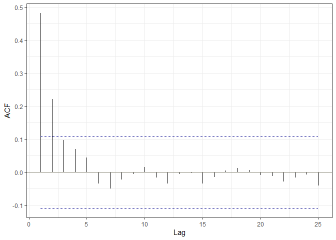
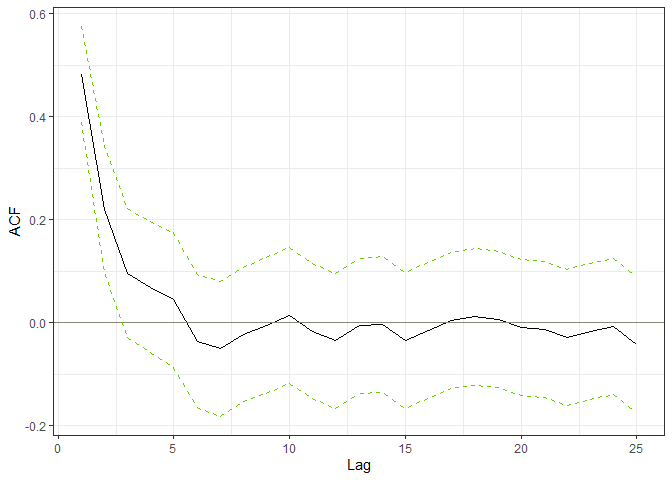
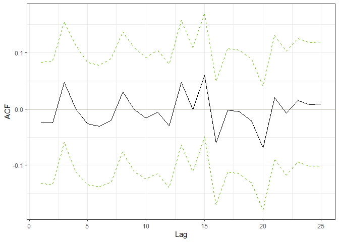
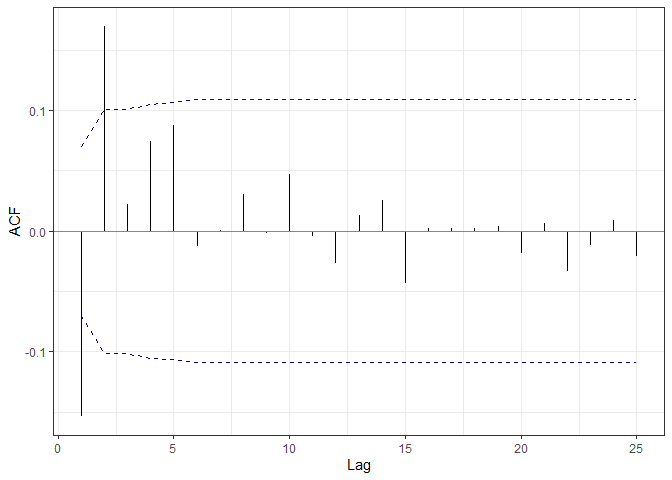

<!-- README.md is generated from README.Rmd. Please edit that file -->

# R package ACFbands

<!-- badges: start -->
<!-- badges: end -->

## Overview

This package accompanies the paper *“Simultaneous Inference Bands for
Autocorrelations”* by Uwe Hassler, Marc-Oliver Pohle and Tanja Zahn.

The goal of ACFbands is to provide *valid simultaneous inference for a
vector of autocorrelations* of a time series or of a series of
regression residuals. The package allows to compute simultaneous
*significance bands* for testing the hypothesis of white noise, i.e. the
absence of serial correlation, as well as simultaneous *confidence
bands* without imposing a specific null hypothesis. Further, it provides
plots of the sample autocorrelations with the respective bands allowing
for an easy graphical inspection and interpretability.

There are *three main functions*. The first two are applicable to a
stationary time series or a series of residuals from a static regression
without lagged endogeneous regressors:

- `acf_sigbands`: Estimate and plot autocorrelations with significance
  bands for the null hypothesis of white noise. If the sample
  autocorrelations leave the significance bands at any lag, the null
  hypothesis is rejected at significance level `alpha`.
- `acf_confbands`: Estimate and plot autocorrelations with confidence
  bands of level `1-alpha`.

The third function is the dynamic version of `acf_sigbands`. It is
suitable for residuals from a dynamic regression with lagged endogenous
regressors:

- `acf_sigbands_dyn`: Estimate and plot autocorrelations with
  significance bands for the null hypothesis of white noise. If the
  sample autocorrelations leave the significance bands at any lag, the
  null hypothesis is rejected at significance level `alpha`.

## Installation

To install the package from Github and load it, run the following `R`
code:

``` r
# install.packages("devtools")
library(devtools)
install_github("TanjaZahn/ACFbands")
library(ACFbands)
```

## Examples

### Autocorrelations for a time series or residuals from a static regression

The first example follows the simulation setup used in the paper. First,
we generate a time series by drawing observations from an AR(1) process
with parameter `phi` equal to 0.5. Second, we estimate the
autocorrelations of the time series and construct simultaneous
significance bands for the hypothesis of white noise. Results can be
either presented as a plot (the default) or as a list by setting
`plot = FALSE`. From the plot, one can directly see that the null
hypothesis of white noise is rejected at level `alpha` as the sample
autocorrelation of the first lag is outside of the significance band.

``` r
set.seed(42)

## Create artificial data from an AR(1) process
N <- 800 # length of the time series
I <- 50 # burn-in period
phi <- 0.5 # coefficient in AR(1) process
epsilon <- rnorm(n = N + I, mean = 0, sd = 1) # draw error (I values for burn-in period)
y <- epsilon[1] # Initialization
for(tt in 2:(N + I)) y[tt] <- phi*y[tt-1] + epsilon[tt] # AR model
y <- y[-(1:I)] # disregard burn-in observations
 
## Plot autocorrelations with simultaneous significance bands using default settings
acf_sigbands(y, H = 25, type = "simultaneous",  alpha = 0.05, plot = TRUE)
```



``` r

## Obtain results as a list
acf_sigbands(y, plot = FALSE)
#> $rho_hat
#>  [1]  0.481224897  0.220287163  0.095828710  0.068572196  0.043882136
#>  [6] -0.036206162 -0.051033848 -0.023021429 -0.006134013  0.014114811
#> [11] -0.016527950 -0.035559549 -0.006511394 -0.003334992 -0.035312505
#> [16] -0.016166743  0.003961209  0.010886373  0.005176835 -0.009698619
#> [21] -0.013030961 -0.029617578 -0.016964488 -0.008171468 -0.042103409
#> 
#> $sig_band
#>             lb        ub     width
#> h1  -0.1089986 0.1089986 0.2179972
#> h2  -0.1089986 0.1089986 0.2179972
#> h3  -0.1089986 0.1089986 0.2179972
#> h4  -0.1089986 0.1089986 0.2179972
#> h5  -0.1089986 0.1089986 0.2179972
#> h6  -0.1089986 0.1089986 0.2179972
#> h7  -0.1089986 0.1089986 0.2179972
#> h8  -0.1089986 0.1089986 0.2179972
#> h9  -0.1089986 0.1089986 0.2179972
#> h10 -0.1089986 0.1089986 0.2179972
#> h11 -0.1089986 0.1089986 0.2179972
#> h12 -0.1089986 0.1089986 0.2179972
#> h13 -0.1089986 0.1089986 0.2179972
#> h14 -0.1089986 0.1089986 0.2179972
#> h15 -0.1089986 0.1089986 0.2179972
#> h16 -0.1089986 0.1089986 0.2179972
#> h17 -0.1089986 0.1089986 0.2179972
#> h18 -0.1089986 0.1089986 0.2179972
#> h19 -0.1089986 0.1089986 0.2179972
#> h20 -0.1089986 0.1089986 0.2179972
#> h21 -0.1089986 0.1089986 0.2179972
#> h22 -0.1089986 0.1089986 0.2179972
#> h23 -0.1089986 0.1089986 0.2179972
#> h24 -0.1089986 0.1089986 0.2179972
#> h25 -0.1089986 0.1089986 0.2179972
```

Next, we construct `1-alpha`confidence bands that are not tied to a
specific null hypothesis:

``` r
set.seed(42)

## Plot autocorrelations with with sup-t confidence bands using default settings
acf_confbands(y, H = 25, type = "sup-t", L = sqrt(length(y)), alpha = 0.05, plot = TRUE, B_hat = NULL, B_hat_diag = NULL)
```

 The
functions `acf_sigbands` and `acf_confbands`can also be used on
regression residuals from a static regression. As a toy example, we
create observations from an distributed lag model and run a regression.
Afterwards, we create confidence bands for the autocorrelations for the
residuals.

``` r
set.seed(42)

# Create external regressor
N <- 800 # length of the time series
I <- 50 # burn-in period
zeta <- rnorm(n = N + I, mean = 0, sd = 1) # Draw normal errors
z <- zeta[1] # Initialiation
delta <- 0.3 # coefficient in AR(1) process
for(tt in 2:(N + I)) z[tt] <- delta*z[tt-1] + zeta[tt] # AR model
z <- z[-(1:I)] # disregard burn-in observations

# Create data from distributed lag model
epsilon <- rnorm(n = N, mean = 0, sd = 1)
y <- 0.5*z + epsilon
 
## Run regression and obtain residuals
res <- lm(y ~ z)$residuals

## Plot confidence bands
acf_confbands(y = res)
```



### Autocorrelations for residuals from a dynamic regression with lagged endogeneous regressors

If the regression contains lagged endogeneous regressors, the function
`acf_sigbands_dyn` provides valid significance bands. Again, we follow
the setup used in the simulation studies of the paper. The true DGP is
an AR(2) model with parameters `phi1`and `phi2`. However, we only
estimate an AR(1) model. Thus, the model is misspecified and we know
that the residuals will be autocorrelated. Indeed, the plot generated by
`acf_sigbands_dyn`shows that the first two lags lie outside of the
significance band. Thus, the null hypothesis of white noise errors is
rejected.

``` r
set.seed(42)

## Create data
N <- 800 # length of the time series
I <- 50 # burn-in period
phi1 <- 0.5 # coefficient of lag 1
phi2 <- 0.25 # coefficient of lag 2
epsilon <- rnorm(n = N + I, mean = 0, sd = 1) # Draw normal error
y <- epsilon[1:2] # Initialization
for(tt in 3:(N + I)) y[tt] <- phi1*y[tt-1] + phi2*y[tt-2] + epsilon[tt] # AR(2) model
df <- data.frame(y = y, L1_y = dplyr::lag(y, 1)) # Collect results in a data frame
df <- df[-(1:I), ] # Disregard burn-in observations
  
## Fit an AR(1) model to the data
fit <- lm(y ~ L1_y, df)

## Construct singificance bands
acf_sigbands_dyn(fit, H = 25, type = "simultaneous", error = "hom", alpha = 0.05, plot = TRUE, Sigma_rho_hat = NULL)
```


